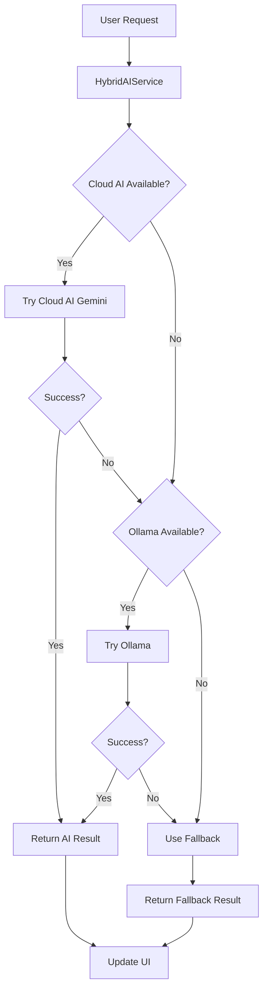

# AI Integration - Hybrid Cloud & Local Approach

This directory contains the AI integration services for the VoQuadro public speaking app, implementing a **three-tier hybrid approach** that works seamlessly across mobile, desktop, and offline scenarios.

## 🎯 Architecture Overview

The system prioritizes AI services in this order:

1. **Cloud AI (Gemini)** - Primary for mobile devices
2. **Ollama** - Secondary for desktop/development
3. **Fallback** - Static/rule-based for offline support

### Service Components

#### 1. CloudAIService (`cloud_ai_service.dart`) ✨ NEW

- **Purpose**: Cloud-based AI for mobile devices (no local installation needed)
- **Provider**: Google Gemini API (free tier: 15 req/min, 1M tokens/day)
- **Features**:
  - AI-generated questions
  - Comprehensive speech analysis
  - Detailed feedback with scores
  - Works on iOS, Android, and Web
- **Requirements**: Internet connection + API key

#### 2. OllamaService (`ollama_service.dart`)

- **Purpose**: Local AI for desktop/development environments
- **Features**: Advanced AI when Ollama is installed locally
- **Requirements**: Ollama installed and running

#### 3. Fallback Services

- **FallbackQuestionService**: 200+ static questions across 20+ topics
- **FallbackFeedbackService**: Rule-based feedback and scoring
- **Works**: Completely offline, no dependencies

#### 4. HybridAIService (`hybrid_ai_service.dart`)

- **Purpose**: Orchestrates all AI services with intelligent fallback
- **Behavior**: Cloud AI → Ollama → Fallback (automatic switching)
- **Provides**: Transparent interface to the rest of the app

## 🚀 Quick Start

### For Mobile Users (Recommended)

1. **Get a free Gemini API key**:
   - Visit: https://makersuite.google.com/app/apikey
   - Click "Create API Key"
   - Copy your key

2. **Add to `.env` file**:

   ```env
   GEMINI_API_KEY=your_api_key_here
   ```

3. **Run your app** - Cloud AI will work automatically! 🎉

### For Desktop Developers (Optional)

Ollama provides additional AI capabilities for development:

1. Install Ollama from https://ollama.ai
2. Run: `ollama pull qwen2.5:0.5b`
3. Start: `ollama serve`
4. Configure in `.env`:
   ```env
   OLLAMA_BASE_URL=http://localhost:11434
   OLLAMA_MODEL_NAME=qwen2.5:0.5b
   ```

### Offline Support

Works automatically without any setup - uses static question bank and rule-based feedback.

## 📊 How It Works



## 🔑 Service Priority & Use Cases

| Scenario         | Cloud AI       | Ollama    | Fallback    |
| ---------------- | -------------- | --------- | ----------- |
| Mobile (online)  | ✅ Primary     | ❌ N/A    | Backup      |
| Mobile (offline) | ❌ No internet | ❌ N/A    | ✅ Active   |
| Desktop (dev)    | ✅ Fast        | ✅ Backup | Last resort |
| Web app          | ✅ Primary     | ❌ N/A    | Backup      |

## 📱 Mobile Integration Benefits

### Why Cloud AI for Mobile?

✅ **No Installation Required** - Users don't need to install anything  
✅ **Works Out of Box** - Just add API key and go  
✅ **Cross-Platform** - iOS, Android, Web all supported  
✅ **Free Tier** - Generous limits for most users  
✅ **Always Updated** - Latest AI models without app updates  
✅ **Low Device Impact** - Doesn't drain battery or use storage

### Comparison

| Aspect      | Cloud AI (Gemini)  | On-Device AI             | Ollama Mobile   |
| ----------- | ------------------ | ------------------------ | --------------- |
| Setup       | API key only       | Download models (100MB+) | ❌ Not feasible |
| Performance | Fast, server-grade | Device-dependent         | ❌ Not possible |
| Battery     | Minimal            | High during inference    | ❌ N/A          |
| Storage     | None               | 100MB - 2GB              | ❌ N/A          |
| Quality     | Latest models      | Limited models           | ❌ N/A          |
| Offline     | ❌ Needs internet  | ✅ Works offline         | ❌ N/A          |

## 🛠️ API Usage

### Check AI Availability

```dart
final hybridAI = HybridAIService.instance;

// Check all AI services
await hybridAI.checkAIAvailability();

// Check which service is active
print(hybridAI.activeAIService); // "Cloud AI (Gemini)" | "Ollama" | "Fallback"
print(hybridAI.isCloudAIAvailable);
print(hybridAI.isOllamaAvailable);
print(hybridAI.isUsingFallback);
```

### Generate Questions

```dart
final hybridAI = HybridAIService.instance;

// Automatically uses best available AI
final session = await hybridAI.generateQuestion("Technology");
print(session.generatedQuestion);
```

### Get Comprehensive Feedback

```dart
// Returns detailed feedback + scores
final result = await hybridAI.getPublicSpeakingFeedbackWithScores(
  transcript,
  session,
  wordCount: 150,
  fillerCount: 3,
  durationSeconds: 90,
);

print(result['feedback']); // Formatted feedback text
print(result['scores']); // { overall: 85, content_quality: 80, clarity_structure: 90 }
```

### Individual Scores

```dart
// Get specific scores
final contentScore = await hybridAI.contentQualityScore(transcript);
final clarityScore = await hybridAI.clarityStructureScore(transcript);
final overallScore = await hybridAI.overallScore(transcript);
```

## 💰 Cost & Limits

### Google Gemini Free Tier

- **Rate Limit**: 15 requests per minute
- **Daily Quota**: 1 million tokens per day
- **Sufficient for**: ~1,000+ speeches per day
- **Cost**: FREE for most users
- **Paid tier**: Available if needed ($0.001/1K tokens)

### Upgrade Path

When users exceed free tier, you can:

1. Implement user-specific API keys
2. Upgrade to paid tier (very affordable)
3. Use rate limiting / caching
4. Fall back to static content

## 🔒 Security Best Practices

### Protecting Your API Key

```dart
// ✅ DO: Use environment variables
final apiKey = dotenv.env['GEMINI_API_KEY'];

// ❌ DON'T: Hardcode in source
final apiKey = 'AIzaSy...'; // Never do this!
```

### Production Deployment

For production apps:

1. **Option A**: Use your own API key (simple)
   - Good for: Small apps, MVPs
   - Limit: You pay for all usage

2. **Option B**: Backend proxy (recommended for scale)

   ```dart
   // Your backend handles API calls
   final response = await http.post(
     'https://yourapi.com/generate-question',
     body: {'topic': topic},
   );
   ```

   - Good for: Large apps, commercial use
   - Benefit: Better security, rate limiting, monitoring

3. **Option C**: User-provided keys
   - Users bring their own Gemini API keys
   - Good for: Power users, developer tools

## 📈 Performance Optimization

### Response Times (Typical)

- Cloud AI: 1-3 seconds
- Ollama: 3-10 seconds (depends on hardware)
- Fallback: Instant (<100ms)

### Caching Strategy

The services automatically cache:

- Connection status (5 minutes)
- No duplicate API calls for same request

### Tips for Best Performance

```dart
// Preload AI check on app start
void initState() {
  super.initState();
  HybridAIService.instance.checkAIAvailability();
}

// Show loading states
if (loading) {
  return CircularProgressIndicator();
}

// Use timeouts
final session = await hybridAI
  .generateQuestion(topic)
  .timeout(Duration(seconds: 30));
```

## 🐛 Troubleshooting

### Cloud AI Not Working

1. **Check API key**: Ensure `GEMINI_API_KEY` is set in `.env`
2. **Internet connection**: Cloud AI requires internet
3. **Check logs**: Look for "Cloud AI" debug messages
4. **Verify quota**: Check https://makersuite.google.com/app/apikey

### Ollama Not Working (Desktop)

1. **Check Ollama is running**: `ollama list`
2. **Verify URL**: Check `OLLAMA_BASE_URL` in `.env`
3. **Model pulled**: `ollama pull qwen2.5:0.5b`

### Always Using Fallback

- This is normal if:
  - No API key configured
  - No internet (mobile)
  - Ollama not running (desktop)
  - Both services unavailable

Debug with:

```dart
await hybridAI.forceCheckAIAvailability();
print('Cloud AI: ${hybridAI.isCloudAIAvailable}');
print('Ollama: ${hybridAI.isOllamaAvailable}');
print('Active: ${hybridAI.activeAIService}');
```

## 🎨 UI Integration

Show users which AI service is active:

```dart
Widget buildAIStatusBadge() {
  final ai = HybridAIService.instance;

  return Chip(
    avatar: Icon(
      ai.isCloudAIAvailable ? Icons.cloud :
      ai.isOllamaAvailable ? Icons.computer :
      Icons.offline_bolt,
    ),
    label: Text(ai.activeAIService),
    backgroundColor: ai.isCloudAIAvailable ? Colors.blue :
                     ai.isOllamaAvailable ? Colors.green :
                     Colors.grey,
  );
}
```

## 🔄 Migration from Ollama-Only

Existing code continues to work! The service is backward compatible:

```dart
// Old code still works
await hybridAI.checkOllamaAvailability(); // Works!
final isOllama = hybridAI.isOllamaAvailable; // Works!

// But now you can also use:
await hybridAI.checkAIAvailability(); // Better!
final activeService = hybridAI.activeAIService; // New!
```

## 📚 Additional Resources

- [Google Gemini API Docs](https://ai.google.dev/docs)
- [Get API Key](https://makersuite.google.com/app/apikey)
- [Ollama Documentation](https://ollama.ai/docs)
- [Flutter Environment Variables](https://pub.dev/packages/flutter_dotenv)

## 🎯 Next Steps

1. ✅ Get Gemini API key
2. ✅ Add to `.env` file
3. ✅ Test on mobile device
4. ✅ Deploy to users
5. 🚀 Enjoy AI-powered speech feedback!

- Users get advanced AI features
- Status shows "Using Ollama AI (Advanced)"
- Full feature set available

### When Ollama is Not Available

- App continues to work with basic features
- Status shows "Using Offline Mode (Basic)"
- Users can still practice public speaking
- Installation guide provided in status page

## Benefits

1. **Zero Downtime**: App works regardless of Ollama installation
2. **Cost-Free**: No cloud API costs for the fallback system
3. **Educational**: Perfect for school projects and prototypes
4. **Scalable**: Easy to add more fallback content or upgrade to cloud services
5. **User-Friendly**: Clear status indicators and installation guidance

## Future Enhancements

- Add cloud AI service as middle-tier option (OpenAI, Gemini)
- Expand fallback question bank
- Improve rule-based analysis algorithms
- Add user preference settings for AI service priority
- Implement caching for better performance

## Files Structure

```python
lib/src/ai-integration/
├── README.md                           # This documentation
├── ollama_service.dart                 # Direct Ollama integration
├── fallback_question_service.dart      # Static question bank
├── fallback_feedback_service.dart      # Rule-based feedback
└── hybrid_ai_service.dart              # Main orchestrator
```

## Integration Points

- **PublicSpeakingController**: Uses HybridAIService instead of direct OllamaService
- **Status Page**: Shows AI service status and feature comparison
- **All AI Operations**: Automatically use hybrid approach

This hybrid approach ensures your app works perfectly for a school project while providing a clear upgrade path for production use.
