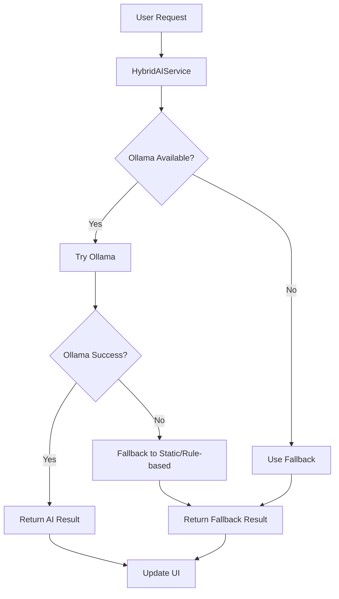

# AI Integration - Hybrid Approach

This directory contains the AI integration services for the VoQuadro public speaking app, implementing a hybrid approach that gracefully handles both Ollama availability and offline scenarios.

## Architecture Overview

The hybrid AI system consists of three main components:

### 1. OllamaService (`ollama_service.dart`)

- **Purpose**: Direct integration with Ollama for advanced AI features
- **Features**: AI-generated questions, advanced speech analysis, detailed feedback
- **Requirements**: Ollama must be installed and running locally

### 2. Fallback Services

- **FallbackQuestionService** (`fallback_question_service.dart`): Provides static question bank with 200+ questions across 20+ topics
- **FallbackFeedbackService** (`fallback_feedback_service.dart`): Rule-based feedback system using heuristics and pattern analysis

### 3. HybridAIService (`hybrid_ai_service.dart`)

- **Purpose**: Orchestrates between Ollama and fallback services
- **Behavior**:
  - Tries Ollama first for all AI operations
  - Falls back to static/rule-based services if Ollama fails
  - Provides transparent interface to the rest of the app

## How It Works



## Service Priority

1. **Primary**: Ollama (when available)

   - Advanced AI question generation
   - Sophisticated speech analysis
   - Context-aware feedback
   - Dynamic scoring algorithms

2. **Fallback**: Static + Rule-based
   - Pre-written question bank (200+ questions)
   - Heuristic-based speech analysis
   - Structured feedback templates
   - Pattern-based scoring

## Key Features

### Question Generation

- **Ollama**: Dynamic, context-aware questions tailored to topics
- **Fallback**: Curated question bank with 8 questions per topic across 20+ topics

### Speech Analysis

- **Ollama**: Advanced NLP analysis with context understanding
- **Fallback**: Rule-based analysis checking for:
  - Relevance to question
  - Speech structure (introduction, conclusion, transitions)
  - Content depth (examples, opinions, details)
  - Speaking pace and filler words

### Feedback Generation

- **Ollama**: Detailed, personalized feedback with specific suggestions
- **Fallback**: Structured feedback covering:
  - Content Quality Evaluation
  - Clarity & Structure Evaluation
  - Overall Performance Assessment

### Scoring System

- **Ollama**: AI-powered scoring with nuanced understanding
- **Fallback**: Heuristic-based scoring using:
  - Relevance analysis (40% weight)
  - Content depth indicators (30% weight)
  - Personal opinion expression (30% weight)

## Usage

The app automatically detects Ollama availability and uses the appropriate service:

```dart
// The controller automatically uses the hybrid service
final controller = PublicSpeakingController();

// Check AI service status
bool isOllamaAvailable = controller.isOllamaAvailable;
String status = controller.aiServiceStatus;
String message = controller.aiServiceMessage;

// Generate questions (works with both services)
await controller.generateQuestionAndStart("Technology");

// Get feedback (works with both services)
await controller.generateScores();
```

## User Experience

### When Ollama is Available

- Users get advanced AI features
- Status shows "Using Ollama AI (Advanced)"
- Full feature set available

### When Ollama is Not Available

- App continues to work with basic features
- Status shows "Using Offline Mode (Basic)"
- Users can still practice public speaking
- Installation guide provided in status page

## Benefits

1. **Zero Downtime**: App works regardless of Ollama installation
2. **Cost-Free**: No cloud API costs for the fallback system
3. **Educational**: Perfect for school projects and prototypes
4. **Scalable**: Easy to add more fallback content or upgrade to cloud services
5. **User-Friendly**: Clear status indicators and installation guidance

## Future Enhancements

- Add cloud AI service as middle-tier option (OpenAI, Gemini)
- Expand fallback question bank
- Improve rule-based analysis algorithms
- Add user preference settings for AI service priority
- Implement caching for better performance

## Files Structure

``` python
lib/src/ai-integration/
├── README.md                           # This documentation
├── ollama_service.dart                 # Direct Ollama integration
├── fallback_question_service.dart      # Static question bank
├── fallback_feedback_service.dart      # Rule-based feedback
└── hybrid_ai_service.dart              # Main orchestrator
```

## Integration Points

- **PublicSpeakingController**: Uses HybridAIService instead of direct OllamaService
- **Status Page**: Shows AI service status and feature comparison
- **All AI Operations**: Automatically use hybrid approach

This hybrid approach ensures your app works perfectly for a school project while providing a clear upgrade path for production use.
